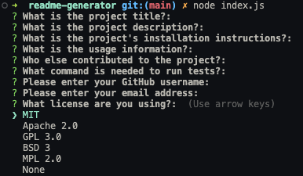

# README Generator


##### Table of Contents

[Description](#description)  
 [Installation](#installation)  
 [Usage](#usage)  
 [Contributions](#contributions)  
 [Tests](#tests)  
 [Questions](#questions)  
 [License](#license)

## Description

This is a project that takes user prompts through a CLI and generates a professional README markdown file. This helps project creators cut down time having to reference different resource to make sure all necessary information is presented in the README.

## Installation

To install dependencies, run the following command:

```
npm i
```

## Usage

To use, run the command in the terminal.

```
node index.js
```

The user will see questions regarding the project. In the terminal, type in the information regarding the question and press the 'enter' key once done answering.



Once all questions are answered, if successful, a final prompt will display saying "generatedREADME.md created!". A new markdown file called ```generatedREADME.md``` will be created within the main project folder with the user provided information formatted in a professional README.

## Contributions

[Starter code](https://github.com/gachoi06) provided by Github users:  
[Xander Rapstine](https://github.com/Xandromus)  
[Grace Choi](https://github.com/gachoi06)

## Tests

For tests, run the following command:

```
npm test
```

## Questions

For any questions regarding the repository, contact me via:

- Github: [dgomie](https://www.github.com/dgomie)
- Email: <a href="mailto:danny.f.gomez@gmail.com">danny.f.gomez@gmail.com</a>

## License

This application is covered under the MIT license  
 https://choosealicense.com/licenses/mit
